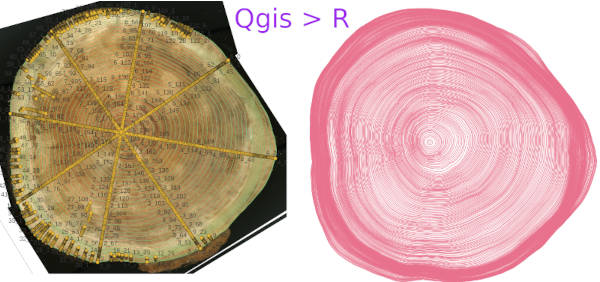
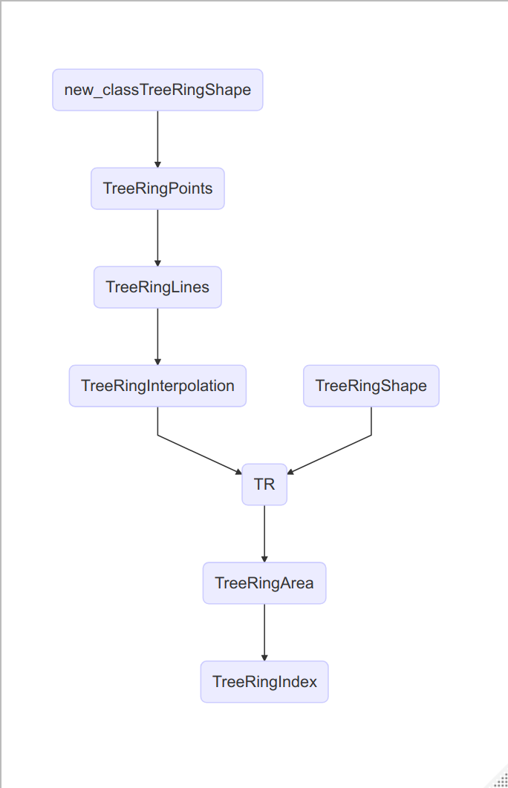

```{r, include = FALSE}
knitr::opts_chunk$set(
  collapse = TRUE,
  comment = "#>"
)
```


This package is designed for efficiently recording the shape of all
annual rings in a tree trunk cross-section. It **interpolates the annual
rings (L2)** between **representative annual ring lines (L)** from the
**annual ring points (P)** and **representative annual ring lines**
inputted on radii measured in GIS software ('Qgis'). A **"representative
annual ring"** refers to the annual rings that characterize the shape of
the outer circumference and the cross-section of the disc, requiring
fewer rings the closer their shape is to a perfect circle. Although
annual rings grow concentrically around the pith, their shape is not
perfectly circular. Traditionally, dendrochronology and tree-ring
analysis have evaluated tree growth based on the width of the annual
rings. However, with the advancement of image analysis technologies,
there has been an increasing number of studies evaluating growth based
on the area of the annual rings. Most of these studies have focused on
conifer plantation samples, where the annual rings are clearly defined.
However, this package also enables the recording of annual ring shapes
in trees from natural forests, where the ring shapes are more complex.
It should be noted, however, that currently, information regarding the
shape of the annual rings needs to be manually inputted, which can be
labor-intensive.




#### Execute

The TreeRingShape() function establishes the S4 class classTreeRingShape
and executes the interpolation of annual rings to complete the annual
ring shape data.


#### Table 1. classTreeRingShape : TR \<- TreeRingShape()

| Slot         | R                                                                    | Qgis                         |
|:-----------------|:------------------------------|:----------------------|
| ***Input***  |                                                                      |                              |
| **P**        | **data frame of Tree Ring Points**                                   | Points shape, field(id,ring) |
| P_filename   | shape file name of tree ring points                                  | \*.shp                       |
| P_id.tag     | column name of id in shape file (P)                                  | default 'id'                 |
| P_ring.tag   | column name of ring no.(ordinaly year,outermost=0)                   | default 'ring'               |
| **L**        | **list of Representative Tree Ring Lines**                           | Lines shape, field(ring)     |
| L_filename   | shape file name for representative tree ring lines (L)               | \*.shp                       |
| L_ring.tag   | column name of ring no.(ordinaly year,outermost=0) in shape file (L) | default 'ring'               |
| ***Append*** |                                                                      |                              |
| **L2**       | **list of All Tree Ring Lines including interpolated lines**         | Lines shape, field(ring)     |
| L2_filename  | file name of shape file (L2) for tree ring lines interpolated        | \*.shp                       |
| **etc.**     | see **classTreeRingShape** for details                               |                              |

 **Flow of making whole tree ring shapes **   
TreeRingShape() includs the prosedure from new_classTreeRingShape() to TreeRingInterpolation()


## Procedures

### I. Processing the Disc

1.  Harvest the tree disc, avoiding areas with branches, rot, or cracks
    as much as possible.

2.  Polish the disc until the annual rings are clearly visible.

3.  Draw lines from the pith in generally eight directions with a
    pencil. These lines are referred to as radii measurement lines.

4.  Starting from the cambium layer (the outermost layer of wood
    touching the bark) as zero, count the annual rings towards the
    inside and mark them.

5.  Ensure that the number of annual rings matches across all radii
    measurement lines.

6.  Trace the lines of representative annual rings with a pencil. This
    improves work efficiency, especially in areas where there are many
    rings or the rings are unclear.

### II. Scanning the Entire Disc Image

-   Scan the entire disc image at 1200 dpi or higher using a flatbed
    scanner or a high-resolution digital camera capable of geometric
    correction.

### III. Inputting Annual Ring Coordinates Using Qgis

1.  Project Properties

    Set the project's CRS to 'none'. Leave the default CRS blank.

2.  Adding Layers

    1.  Import the annual rings raster image (TreeRing\*\*\*.tif).
    2.  Create a new shapefile layer for annual ring points
        (TreeRingPoints\*\*\*.shp) with integer attributes for id and
        ring.
    3.  Create a new shapefile layer for annual ring lines
        (TreeRingLines\*\*\*.shp) with an integer attribute for ring.

3.  Manually Inputting Annual Ring Coordinates

    1.  Annual Ring Points \*\* id \*\* is the number of the radii
        measurement line or the correction point group number, and ring
        is typically the count of the annual rings from the cambium
        layer inward. Mark all annual rings along the radii measurement
        lines. After completing the annual ring interpolation, if there
        is any discrepancy in the rings, add correction points where the
        rings must pass.
    2.  Representative Annual Ring Lines Input the coordinates while
        tracing the lines of annual rings that characterize the shape of
        the outer circumference and the disc. The count starts from the
        cambium layer as zero and goes inward.


### Usage

<https://www.sanchikanri.com/treering/TreeRingShape.html>


### Reference

Pebesma, E., & Bivand, R. (2023). Spatial Data Science: With
Applications in R. Chapman and Hall/CRC.

QGIS Development Team. (2024). QGIS Geographic Information System. QGIS
Association. <https://www.qgis.org/en/site/>
